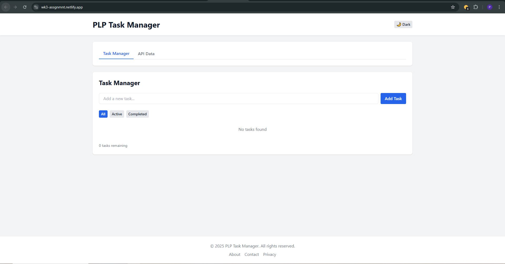
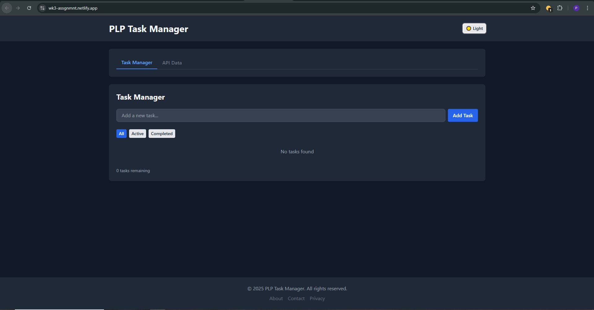

# PLP Task Manager 📝

A modern, responsive React application for managing tasks with API integration, built with Vite, React, and Tailwind CSS.


## ✨ Features


- ✅ **Task Management** - Add, complete, delete, and filter tasks
- 🌙 **Dark/Light Mode** - Toggle between themes
- 📱 **Fully Responsive** - Works on mobile, tablet, and desktop
- 🔄 **API Integration** - Fetch and display posts from JSONPlaceholder
- 💾 **Local Storage** - Persist tasks between sessions
- 🎨 **Modern UI** - Beautiful design with Tailwind CSS
- ⚡ **Fast Development** - Built with Vite for optimal performance

## 🚀 Live Demo

**Live Application:** [https://wk3-assgnmnt.netlify.app/](https://wk3-assgnmnt.netlify.app/)
- 
- 

## 🛠️ Tech Stack

- **Frontend:** React 18, JSX
- **Build Tool:** Vite
- **Styling:** Tailwind CSS
- **Routing:** React Router DOM
- **State Management:** React Hooks (useState, useEffect, useContext)
- **API:** JSONPlaceholder

## 📥 Installation

### Prerequisites

Make sure you have the following installed:
- Node.js (v18 or higher recommended)
- npm or yarn

### Step-by-Step Setup

1. **Clone the repository**
   ```bash
   git clone <your-repository-url>
   cd plp-task-manager

2. **Install dependencies**
   ```bash
   npm install
   ```

3. **Start the development server**
   ```bash
   npm run dev
   ```
4. **Open your browser**
- Navigate to `http://localhost:5173`

## 🏗️ Project Structure
```text
plp-task-manager/
├── src/
│   ├── components/
│   │   ├── Button.jsx
│   │   ├── TaskManager.jsx
│   │   ├── Navbar.jsx
│   │   ├── Footer.jsx
│   │   ├── Card.jsx
│   │   ├── Layout.jsx
│   │   └── ApiDataDisplay.jsx
│   ├── hooks/
│   │   └── useLocalStorage.js
│   ├── App.jsx
│   ├── main.jsx
│   └── index.css
├── public/
├── package.json
├── vite.config.js
├── tailwind.config.js
└── postcss.config.js
```
## 🎯 Usage
### Task Management
- Add Task: Enter task text and click "Add Task"
- Complete Task: Click the checkbox to mark as completed
- Delete Task: Click the "Delete" button
- Filter Tasks: Use filter buttons (All, Active, Completed)

### Theme Toggle
- Click the theme toggle button in the navbar to switch between light and dark modes

### API Data
- View posts fetched from JSONPlaceholder API
- Search through posts using the search bar
- Load more posts with pagination

## 📦 Build for Production
```bash
# Create production build
npm run build

# Preview production build locally
npm run preview
```

### 🌐 Deployment
- #### Deploy to Vercel 
   1. Install Vercel CLI
      ```bash
      npm install -g vercel
      ```

   2. Deploy
      ```bash
      vercel
      ```
   3. Or connect your GitHub repository to Vercel for automatic deployments.

- #### Deploy to Netlify
   1. Build the project
      ```bash
      npm run build
      ```

   2. Drag and drop the `dist` folder to [Netlify Drop](https://app.netlify.com/drop)

## 🤝 Contributing
1. Fork the project
2. Create your feature branch (`git checkout -b feature/AmazingFeature`)
3. Commit your changes (`git commit -m 'Add some AmazingFeature'`)
4. Push to the branch (`git push origin feature/AmazingFeature`)
5. Open a Pull Request

## 📝 License
This project is licensed under the MIT License.

## 🙏 Acknowledgments
- [Vite](https://vitejs.dev/) for the fast build tool
- [Tailwind CSS](https://tailwindcss.com/) for the utility-first CSS framework
- [JSONPlaceholder](https://jsonplaceholder.typicode.com/) for the fake API
- [React](https://reactjs.org/) for the amazing library

<div align="center">
Built using React and Tailwind CSS


</div>
